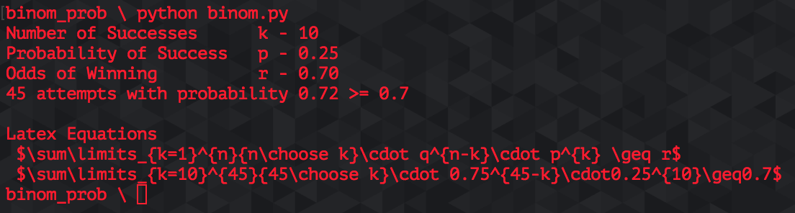

# Binomial Probability


This python script solve Binomial Probability problems.  It iterates through all possible *n* to find the value of *n* that satisfies the equation above.


### Latex
The script also outputs the final equation in Latex for simple file creation
* Template equation
```Latex
$\sum\limits_{k=1}^{n}{n\choose k}* p^{n-k}*q^{k} \geq r$
```


* Example from Class
````Latex
$\sum\limits_{10}^{45}{45\choose 10}* 0.25^{45-10}*0.75^{10} \geq 0.7$
```


### Example problem
If there is a 25% probability of making a given shot how many shots do you need to take to make 10 shots with 70% odds ?
(or there is a 70% chance you make 10 shots if you shoot n shots with an accuracy of 25%)

In this case k = 10, p = 0.25, r = 0.70 and the program finds n (n=45)


*due to limitations in markdown the formulas are just .svg images and not properly formatted inline
